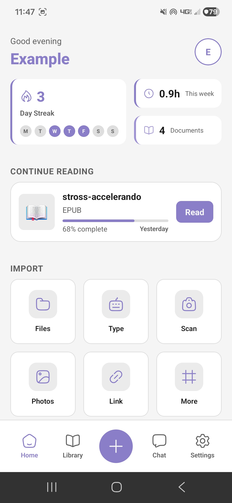
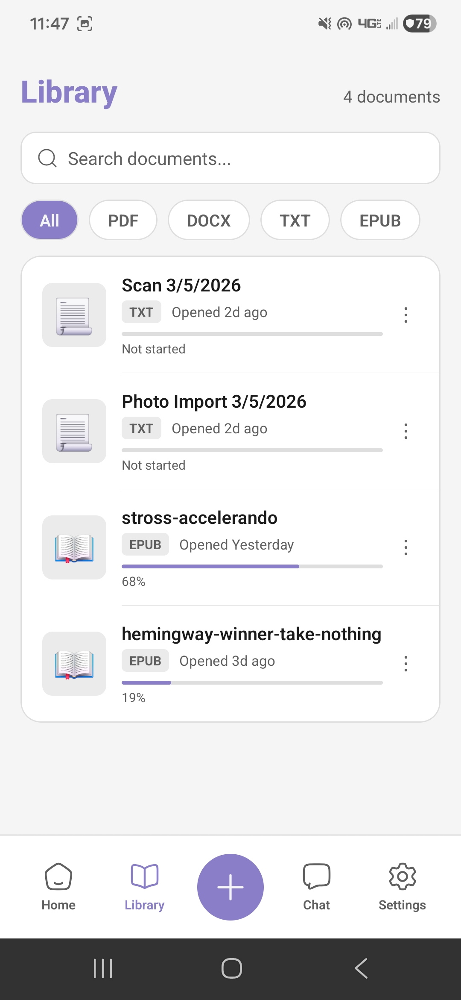
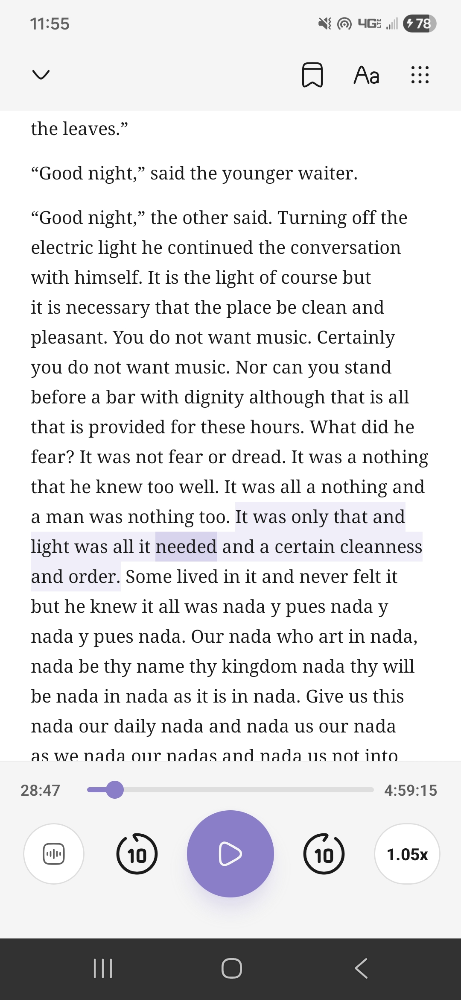
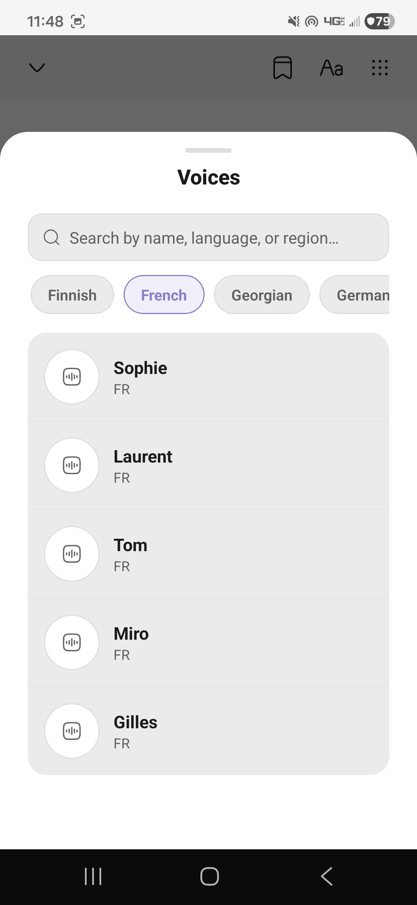
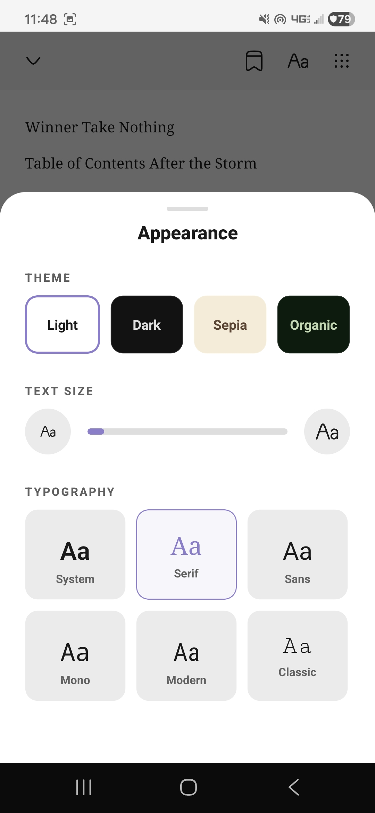

# OrganicReader

A mobile reading app that turns documents into natural speech. Built with React Native, fully offline, no subscriptions or distractions.

  
  
  
  
  

---

## What it does

Import a PDF, EPUB, DOCX, or TXT, then read it or listen to it. The TTS engine runs entirely on-device using [Piper](https://github.com/rhasspy/piper) neural voices.

- **On-device TTS:** 30+ natural voices across a dozen languages, zero cloud calls
- **Sentence-level highlighting:** text tracks audio in real time as it plays
- **Formats:** PDF, EPUB, DOCX, TXT, web links, photos, scans
- **Stats:** streaks, weekly hours, per-document progress
- **Appearance:** Light, Dark, Sepia, and Organic themes for document view
- **Fully offline:** works without internet after initial model download

## Stack

| Layer | Tech |
|---|---|
| Framework | React Native (TypeScript) |
| TTS engine | `react-native-sherpa-onnx-offline-tts` (Piper ONNX models) |
| Audio playback | `react-native-track-player` |
| File I/O | `react-native-fs`, `react-native-zip-archive` |
| State | React Context (Theme, Library, Auth, Playback, TTS) |

## Architecture notes

Documents of all types (PDF, EPUB, DOCX) are extracted to plain text and rendered through a single text viewer component. The TTS pipeline segments text, generates WAV chunks ahead of the playback cursor via a buffer, and feeds them to a queue. Speed control is handled at the player layer so generation is fast regardless of playback speed.

## Status

Active development. Core reading and TTS are fully working. Chat assistant and cloud sync are planned.
